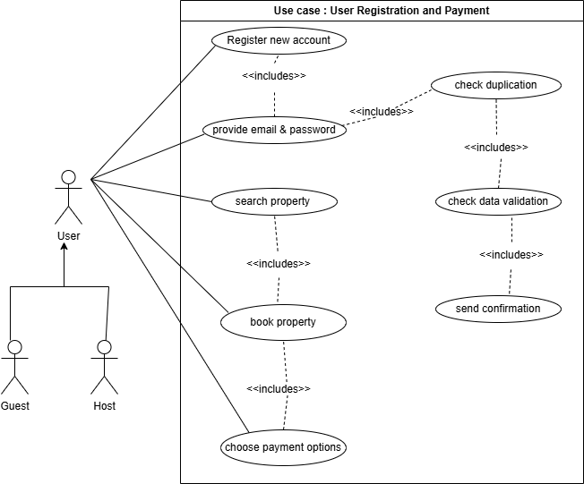
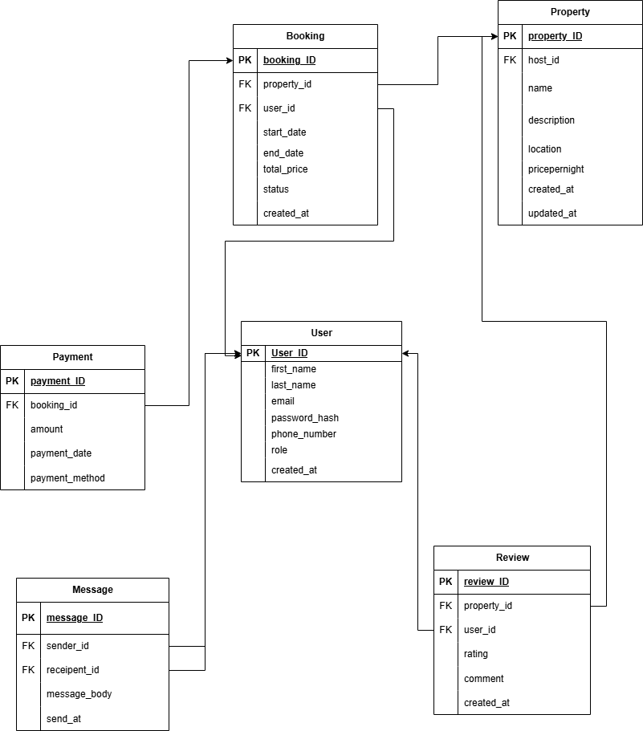
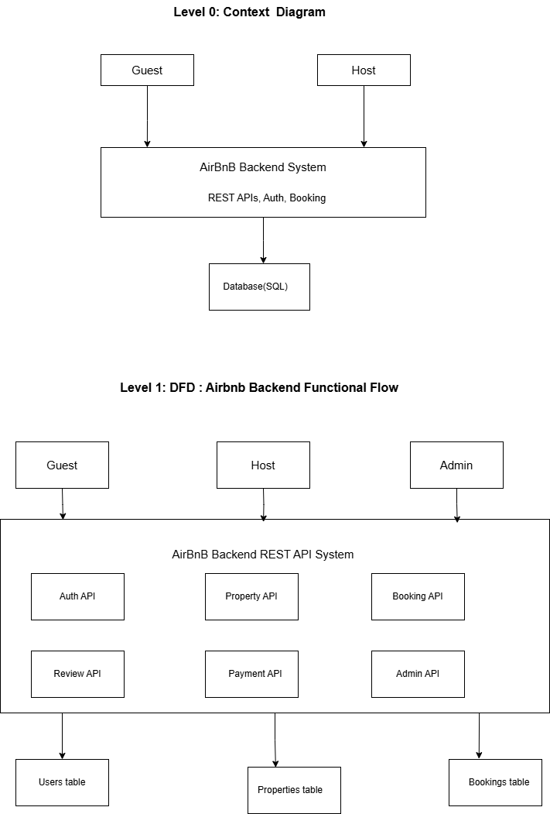

# System Requirements

## 1. Introduction
1.1 Purpose 
The objective of this documentation is to demonstrate the systems software requirements, user interaction, and detailed overview of the AirBnB clone project. After reading this SRS document it is anticipated that the features and functionalities are clearly understood and the further design work is based on it. This documentation will serve as the basis and reference for the design and development process in the future and will be changed when necessary, it will be the foundation for communication within the development team and also stakeholders. 

1.2 Scope 
This project will be focused on backend development of the AirBnB clone which is a web application with core functionality scope:
- It will enable the user to book and list properties for rent
- It will enable users to search and filter properties based on thier liking
- It will enable users to pay using different payment methods
- It will provide a powerful admin dashboard to make user experience smooth

The system contains a database which provides: 
 List of station with their tariff 
 List of cities in Ethiopia with their tariff from Addis Ababa. 
 List of traffic’s name and ID 
This data base keep records of names, emails, phone numbers, plates number and number of 
reports. The system allows users to search name of station and allow authorized person to check 
number reports by searching plate numbers.  
The Limitations of the project: 
 It addresses only a part of community capable of using internet and who can afford smartphone. 
 It can’t be accessed offline since it is web application. 
1.3 Overview 
As previously stated above, the purpose of the documenation is to provide readers with enough information about the project structure, core functional and non-functional requirements supported with different UML diagrams and textual expalnations.
, the purpose of the document is to provide readers with extensive 
information about the project structure, and the text is arranged in such a way that readers can 
quickly move through the sections. The project's general description, which includes product 
perspective, product functionalities, user characteristics, and general constraints , is covered in 
the next section of this document. External interface requirements, use cases, non-functional 
requirements, and other sub-sections are covered in the Specific Requirements section. It also reflects the project's change management process. At the end of the document, the reader will 
discover References. 
The table of contents clearly explains the document's structure, allowing users to locate any 
parts or subsections in the document by page number. 

## 2. Functional Requirements
- Users mangement
- Property listing mangement
- Search and filtering
- Booking management
- Payment Integration
- Reviews ratings
- Notification system
- Admin dashbord

## 3. Non-functional Requirements
- Performance optimization
- Scalability
- Security
- Testing

## 4. Use Case Diagrams
<!--*(Insert draw.io diagram)*-->

## 5. ER Diagram
<!--*(Insert draw.io ER diagram)*-->

## 6. System Flow
<!--*(Insert flowchart)*-->

## 7. Data Flow Diagram

